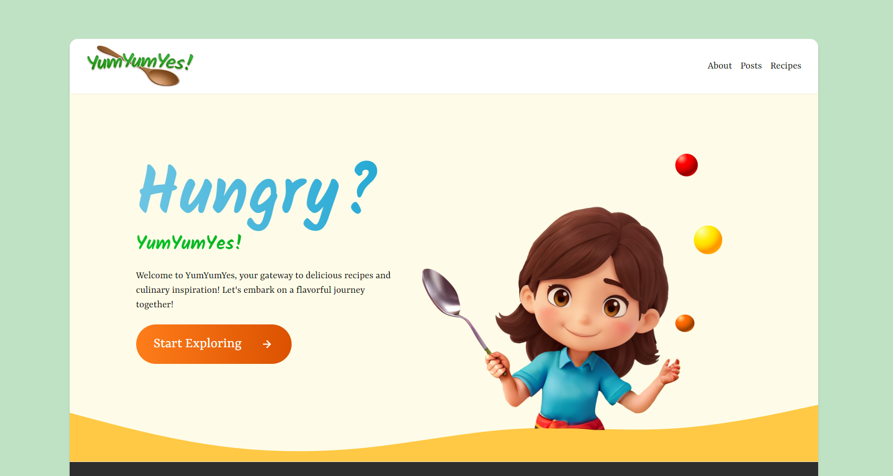

<!-- Improved compatibility of back to top link: See: https://github.com/othneildrew/Best-README-Template/pull/73 -->

<a name="readme-top"></a>

<!--
*** Thanks for checking out the Best-README-Template. If you have a suggestion
*** that would make this better, please fork the repo and create a pull request
*** or simply open an issue with the tag "enhancement".
*** Don't forget to give the project a star!
*** Thanks again! Now go create something AMAZING! :D
-->

<!-- PROJECT SHIELDS -->
<!--
*** I'm using markdown "reference style" links for readability.
*** Reference links are enclosed in brackets [ ] instead of parentheses ( ).
*** See the bottom of this document for the declaration of the reference variables
*** for contributors-url, forks-url, etc. This is an optional, concise syntax you may use.
*** https://www.markdownguide.org/basic-syntax/#reference-style-links
-->

<!--PROJECT LOGO -->
<br />
<div align="center">
<a href="https://github.com/chingu-voyages/v46-tier2-team-19">

</a>
<h3 align="center">YumYumYes.com - Recipe Search Web App</h3>
<p align="center">

YumYumYes! is a beautiful, full-featured, responsive web app that interfaces with the [Tasty API](https://rapidapi.com/apidojo/api/tasty) and allows users to search, view and save recipes. It was built from the ground up for [Chingu Voyage 46](https://github.com/chingu-voyages/voyage-project-tier2-recipes).
<br />
<a href="https://github.com/chingu-voyages/v46-tier2-team-19">
<strong>Explore the docs</strong></a>
<br />
<br />
<a href="http://www.YumYumYes.com/">View Demo</a>
<a href="https://github.com/chingu-voyages/v46-tier2-team-19/issues">Report Bug</a>
<a href="https://github.com/chingu-voyages/v46-tier2-team-19/issues">Request Feature</a>

</p>
</div>
<!-- TABLE OF CONTENTS -->
<details>
<summary> Table of contents</summary>
<ol>
<li>
    <a href='#overview'>Overview</a>
    <ul>
    <li><a href='#features'>Features</a></li>
    <li><a href='#technologies'>Technologies</a></li>
    </ul>

</li>
 <li>
 <a href='#the-challenge'>The challenge</a>
        <ul>
            <li><a href='#about-chingu'>About Chingu</a></li>
            <li><a href='#basic-requirements'>Basic requirements</a></li>
        </ul>
 </li>
<li>
   <a href='#our-solution'>Our Solution</a>
   <ul>
    <li><a href='#concept'>Concept</a></li>
    <li><a href='#screenshots'>Screenshots</a></li>
    <li><a href='#links'>Links</a></li>
   </ul>
</li>
<li>
    <a href="#getting-started">Getting Started</a>
    <ul>
        <li><a href="run-locally">Run Locally</a></li>
    </ul>
</li>
<li><a href="#the-team">The Team</a></li>
</ol>
</details>

## Overview

### Features

YumYumYes allows users to:

- Ability to search for recipes by ingredient(s)
- Filter search results based on recipes tags
- Save recipes to their favorites list
- View their personal favorites list at any time

### Technologies

[![Vite][Vite]][Vite-url]
[![Tailwind][Tailwind.css]][Tailwind-url]
[![React-Query][React-Query]][React-Query-url]
[![React-Router][React-Router]][React-Router-url]

<details>
<summary>Dependencies</summary>
<li>Vite.js</li>
<li>Tailwind.css</li>
<li>Headless UI</li>
<li>Axios</li>
<li>React Query</li>
<li>Prettier</li>
<li>ESLint</li>
</details>

<p align="right">(<a href="#readme-top">back to top</a>)</p>

## The challenge

### About Chingu:

Chingu is a community of developers who are passionate about learning, helping others, and collaborating on projects. It is a remote, self-organizing, project-based learning platform. Chingu helps you to build your portfolio and network while collaborating on real-world projects with remote team members. "Chingus" are motivated learners who are self-directed and take responsibility for their own learning.

### Basic requirements:

> Use the Tasty API to create an app that will help anyone interested in creating dishes and flavours to explore recipes in novel ways.

**Landing Page**

_User can see a landing page containing at least the following components:_

- [x] Header component displaying a welcome message.
- [x] Search field that enables users to input ingredient(s).
- [x] Component to explain the use of the application.
- [x] A scrollable list of recipes displaying the results based on the search criteria. Keep in mind that the Recipe API has over 1500 Recipes, however, it's paginated with 20 recipes per page of result.
- [x] A summary main recipe component: it should display recipe image, name and link to details.
- [x] A summary detail recipe component: it should display recipe name, category, and instructions.
- [x] Ensure mobile responsiveness for the application.

**Search Component**

_Users can input one or multiple ingredient(s)._

- [x] Initiate the search by either pressing the Enter key or clicking the 'Search' button/icon.
- [x] Display an error message when an unlisted item is entered.

**Main Data Display Component**

- [x] Display results for each recipe in the main component.
- [x] Remain on the landing page if no search ingredient has been entered.

**Summary Detail Component**

_Display the following information of the selected recipe:_

- [x] Name
- [x] Category
- [x] List of instruction
- [x] List of nutrition
- [x] Add a Link to the instruction video

<p align="right">(<a href="#readme-top">back to top</a>)</p>

## Our Solution

### Concept

We developed a unique web app with a distinctive brand and a whimsical, animated design. YumYumYes! is intended to make recipe browsing fun! Colorful mascots Yumi and Chef Carrots welcome visitors to our pages, and delightful visual motifs including text gradients, 3d colored balls, dashed lines and gentle curves are intended to make the app feel more alive and engaging.

The app is built as a fully responsive web app compatible with all modern web browsers, both mobile and desktop. We've taken care to make it intuitive for all users, and accessible to users with different abilities.

### Screenshots

<div style="display:flex;gap:1rem;flex-wrap:wrap;">
    <div style="flex:1;min-width: 200px;">
        <em>Home Page</em>
        <a href="public/screenshots/screenshot-home-dev.png">
            
        </a>
    </div>
</div>

### Links

- Live Site URL: [YumYumYes.com](https://yumyumyes.com)
- Source Code: [Github Repository](https://github.com/chingu-voyages/v46-tier2-team-19)
- Design Mockup: [YumYumYes Figma Mockup](https://www.figma.com/file/CbJFJOPY0r5EbEpRSNrx9b/YumYumYes-wireframe)

<p align="right">(<a href="#readme-top">back to top</a>)</p>

<!-- GETTING STARTED -->

## Getting Started

### Run Locally:

#### 1. signup for a RapidAPI account to get a API Key at [Tasty API](https://rapidapi.com/apidojo/api/tasty)

#### 2. Clone project locally:

```javascript
git clone git@github.com:chingu-voyages/v46-tier2-team-19.git

```

#### 3. Create a `.env.local` file and add environment variables

#### 4. Run Client:

```javascript
cd v46-tier2-team-19
npm install
npm run dev
```

<p align="right">(<a href="#readme-top">back to top</a>)</p>

<!-- MEET THE TEAM -->

## The Team

- [Greimil Nuñez](https://github.com/Greimil)
- [Darrick Fauvel](https://github.com/DarrickFauvel)
- [Tim DeHof](https://github.com/timDeHof)
- [Joseph Kotvas](https://github.com/joekotvas)
- [Henri Lambertucci](https://github.com/henrike32)

#### Thank you to [Jim](https://github.com/jdmedlock) and the [Chingu](https://www.chingu.io/) team!

<p align="right">(<a href="#readme-top">back to top</a>)</p>

<!-- MARKDOWN LINKS & IMAGES -->
<!-- https://www.markdownguide.org/basic-syntax/#reference-style-links -->

[contributors-shield]: https://img.shields.io/github/contributors/github_username/repo_name.svg?style=for-the-badge
[contributors-url]: https://github.com/chingu-voyages/v46-tier2-team-19/graphs/contributors
[forks-shield]: https://img.shields.io/github/forks/github_username/repo_name.svg?style=for-the-badge
[forks-url]: https://github.com/chingu-voyages/v46-tier2-team-19/network/members
[stars-shield]: https://img.shields.io/github/stars/github_username/repo_name.svg?style=for-the-badge
[stars-url]: https://github.com/chingu-voyages/v46-tier2-team-19/stargazers
[issues-shield]: https://img.shields.io/github/issues/github_username/repo_name.svg?style=for-the-badge
[issues-url]: https://github.com/chingu-voyages/v46-tier2-team-19/issues
[license-shield]: https://img.shields.io/github/license/github_username/repo_name.svg?style=for-the-badge
[license-url]: https://github.com/chingu-voyages/v46-tier2-team-19/blob/master/LICENSE.txt
[product-screenshot]: images/screenshot.png
[Vite]: https://img.shields.io/badge/Vite-B73BFE?style=for-the-badge&logo=vite&logoColor=FFD62E
[Vite-url]: https://vitejs.dev/
[React.js]: https://img.shields.io/badge/React-20232A?style=for-the-badge&logo=react&logoColor=61DAFB
[React-url]: https://reactjs.org/
[Tailwind.css]: https://img.shields.io/badge/tailwindcss-%2338B2AC.svg?style=for-the-badge&logo=tailwind-css&logoColor=white
[Tailwind-url]: https://tailwindcss.com/
[React-Query]: https://img.shields.io/badge/React_Query-FF4154?style=for-the-badge&logo=React_Query&logoColor=white
[React-Query-url]: https://tanstack.com/query/latest
[React-Router]: https://img.shields.io/badge/React_Router-CA4245?style=for-the-badge&logo=react-router&logoColor=white
[React-Router-url]: https://reactrouter.com/en/main
[Vue.js]: https://img.shields.io/badge/Vue.js-35495E?style=for-the-badge&logo=vuedotjs&logoColor=4FC08D
[Vue-url]: https://vuejs.org/
[Angular.io]: https://img.shields.io/badge/Angular-DD0031?style=for-the-badge&logo=angular&logoColor=white
[Angular-url]: https://angular.io/
[Svelte.dev]: https://img.shields.io/badge/Svelte-4A4A55?style=for-the-badge&logo=svelte&logoColor=FF3E00
[Svelte-url]: https://svelte.dev/
[Laravel.com]: https://img.shields.io/badge/Laravel-FF2D20?style=for-the-badge&logo=laravel&logoColor=white
[Laravel-url]: https://laravel.com
[Bootstrap.com]: https://img.shields.io/badge/Bootstrap-563D7C?style=for-the-badge&logo=bootstrap&logoColor=white
[Bootstrap-url]: https://getbootstrap.com
[JQuery.com]: https://img.shields.io/badge/jQuery-0769AD?style=for-the-badge&logo=jquery&logoColor=white
[JQuery-url]: https://jquery.com
